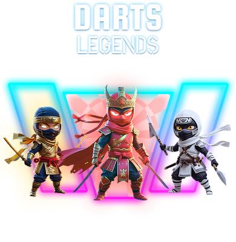

# 🎯 Dart Legend - Frontend Application

<div align="center">
  
  
  [](https://reactjs.org/)
  [](https://www.typescriptlang.org/)
  [](https://vitejs.dev/)
  [](https://ton.org/)
</div>

## 📖 Giới thiệu dự án

**Dart Legend** là một trò chơi ném phi tiêu trực tuyến được xây dựng trên nền tảng TON Blockchain, kết hợp giữa gameplay thú vị và công nghệ Web3. Người chơi có thể tham gia các trận đấu PvP real-time, sưu tập NFT, hoàn thành nhiệm vụ và xây dựng cộng đồng thông qua hệ thống referral.

### 🎮 Tính năng chính

#### Core Gameplay

- **🎯 Dart Throwing Game**: Trò chơi ném phi tiêu với mục tiêu quay tròn, mỗi người chơi có 5 lần ném
- **⚔️ PvP Multiplayer**: Hệ thống matchmaking 1v1 real-time qua WebSocket
- **📊 Scoring System**: Hệ thống tính điểm từ 0-20 dựa trên độ chính xác
- **🔄 Real-time Updates**: Cập nhật trạng thái game và điểm số theo thời gian thực

#### Blockchain & Economy

- **💳 TON Wallet Integration**: Tích hợp TON Connect cho deposit/withdraw
- **💰 In-game Currency**: Hệ thống balance để tham gia game
- **📈 Transaction History**: Lịch sử giao dịch chi tiết
- **🔒 Secure Payments**: Thanh toán an toàn qua TON blockchain

#### NFT Ecosystem

- **🛍️ NFT Marketplace**: Cửa hàng NFT với các loại dart và power-up
- **🎒 Inventory Management**: Quản lý NFT đã sở hữu
- **💎 Collectibles**: Hệ thống sưu tập NFT độc đáo

#### Social & Gamification

- **📅 Daily Check-in**: Điểm danh hàng ngày với phần thưởng tăng dần
- **🎯 Quest System**: Nhiệm vụ social media và in-game
- **👥 Referral Program**: Mời bạn bè và nhận phần thưởng
- **🏆 Leaderboards**: Bảng xếp hạng PNL và Referral

#### Technical Features

- **🎵 Audio System**: Âm thanh nền và hiệu ứng
- **⚡ Performance**: Tối ưu tốc độ và trải nghiệm người dùng

## 📋 Yêu cầu hệ thống

- **Node.js**: >= 18.0.0
- **NPM**: >= 9.0.0
- **Browser**: Chrome/Safari/Firefox (latest versions)
- **Mobile**: iOS Safari, Android Chrome

## 🛠️ Cài đặt và chạy dự án

### 1. Clone repository

```bash
git clone [repository-url]
```

### 2. Cài đặt dependencies

```bash
npm install
```

### 3. Cấu hình Environment Variables

Tạo file `.env` trong thư mục root của project:

```bash
touch .env
```

**⚠️ QUAN TRỌNG:** Cấu hình các biến môi trường sau trong file `.env`:

```env
# API Configuration
VITE_BASE_URL=https://ap
VITE_SOCKET_URL=https://socket

# Telegram Bot Configuration
VITE_TELEGRAM_LINK_BOT=https://t.me/yo

# Optional: Development URLs
# VITE_BASE_URL=http://localhost:3000/api
# VITE_SOCKET_URL=http://localhost:8080
```

#### 📝 Chi tiết các biến môi trường:

| Biến                     | Mô tả                          | Bắt buộc |
| ------------------------ | ------------------------------ | -------- |
| `VITE_BASE_URL`          | URL của API backend            | ✅       |
| `VITE_SOCKET_URL`        | URL của Socket.io server       | ✅       |
| `VITE_TELEGRAM_LINK_BOT` | Link Telegram bot cho referral | ✅       |

### 4. Cấu hình TON Connect Manifest

**⚠️ QUAN TRỌNG:** Cập nhật file `public/tonconnect-manifest.json` với domain của bạn:

```json
{
  "url": "https://your-domain.com",
  "name": "Dart-Legends",
  "iconUrl": "https://your-domain.com/logo.png",
  "features": [
    {
      "name": "SendTransaction"
    }
  ],
  "items": [
    {
      "name": "ton_addr"
    }
  ]
}
```

#### 📝 Chi tiết cấu hình TON Connect:

| Field      | Mô tả                          | Bắt buộc | Ví dụ                              |
| ---------- | ------------------------------ | -------- | ---------------------------------- |
| `url`      | Domain chính của ứng dụng      | ✅       | `https://app.dartlegends.tech`     |
| `name`     | Tên hiển thị trong TON wallet  | ✅       | `Dart-Legends`                     |
| `iconUrl`  | URL icon hiển thị trong wallet | ✅       | `https://your-domain.com/logo.png` |
| `features` | Các tính năng TON Connect      | ✅       | `["SendTransaction"]`              |
| `items`    | Thông tin yêu cầu từ wallet    | ✅       | `["ton_addr"]`                     |

#### 🔧 Cấu hình cho các môi trường khác nhau:

**Development:**

```json
{
  "url": "http://localhost:5173",
  "name": "Dart-Legends-Dev",
  "iconUrl": "http://localhost:5173/logo.png",
  "features": [{ "name": "SendTransaction" }],
  "items": [{ "name": "ton_addr" }]
}
```

**Staging:**

```json
{
  "url": "https://staging.dartlegends.tech",
  "name": "Dart-Legends-Staging",
  "iconUrl": "https://staging.dartlegends.tech/logo.png",
  "features": [{ "name": "SendTransaction" }],
  "items": [{ "name": "ton_addr" }]
}
```

**Production:**

```json
{
  "url": "https://app.dartlegends.tech",
  "name": "Dart-Legends",
  "iconUrl": "https://app.dartlegends.tech/logo.png",
  "features": [{ "name": "SendTransaction" }],
  "items": [{ "name": "ton_addr" }]
}
```

> **💡 Lưu ý quan trọng:**
>
> - File manifest này phải được host tại `https://your-domain.com/tonconnect-manifest.json`
> - TON wallets sẽ truy cập file này để xác thực ứng dụng
> - Đảm bảo `iconUrl` trỏ đến một file PNG/JPG hợp lệ (khuyến nghị 180x180px)
> - Sau khi thay đổi, cần deploy lại để có hiệu lực

### 5. Chạy development server

```bash
npm run dev
```

Ứng dụng sẽ chạy tại `http://localhost:5173`

### 6. Build production

```bash
npm run build
```

### 7. Preview production build

```bash
npm run preview
```

## 📖 Hướng dẫn sử dụng cho End-User

### 🎯 Cách chơi Dart Game

1. **Tham gia trận đấu**:

   - Nhấn nút "PLAY NOW" ở trang chủ
   - Đảm bảo có ít nhất 5 balance để chơi
   - Hệ thống sẽ tìm đối thủ cho bạn

2. **Gameplay**:

   - Mỗi người chơi có 5 lần ném
   - Chạm vào màn hình để ném phi tiêu
   - Mục tiêu sẽ quay liên tục
   - Điểm số từ 0-20 tùy vào vị trí trúng

3. **Thắng thua**:
   - Người có tổng điểm cao hơn sau 5 lần ném sẽ thắng
   - Người thắng nhận phần thưởng
   - Có thể xem kết quả trong phần History

### 💳 Sử dụng Wallet

1. **Kết nối ví TON**:

   - Vào phần WALLET
   - Nhấn "Connect TON Wallet"
   - Chọn ví TON của bạn (Tonkeeper, TON Wallet, v.v.)

2. **Deposit (Nạp tiền)**:

   - Chọn tab DEPOSIT
   - Nhập số lượng TON muốn nạp
   - Xác nhận giao dịch trên ví
   - Balance sẽ được cộng vào tài khoản

3. **Withdraw (Rút tiền)**:
   - Tính năng đang được phát triển
   - Sẽ có trong bản cập nhật tiếp theo

### 🛍️ Mua sắm NFT

1. **Truy cập NFT Store**:

   - Nhấn vào "NFT STORE" ở menu chính
   - Xem danh sách các NFT có sẵn

2. **Mua NFT**:

   - Chọn NFT muốn mua
   - Kiểm tra giá và thông tin
   - Nhấn "BUY" và xác nhận
   - NFT sẽ được thêm vào Inventory

3. **Quản lý Inventory**:
   - Vào phần "INVENTORY" để xem NFT đã sở hữu
   - Có thể xem chi tiết từng NFT

### 📋 Hoàn thành Missions

1. **Daily Check-in**:

   - Vào phần "MISSION" → tab "DAILY"
   - Nhấn vào ngày hiện tại để check-in
   - Nhận phần thưởng hàng ngày
   - Phần thưởng tăng dần qua 7 ngày

2. **Social Tasks**:
   - Chuyển sang tab "QUEST"
   - Chọn nhiệm vụ muốn làm
   - Nhấn "FOLLOW" để mở link
   - Sau khi hoàn thành, nhấn "CLAIM" để nhận thưởng

### 👥 Mời bạn bè

1. **Lấy link referral**:

   - Vào phần "REFERAL"
   - Copy link mời hoặc nhấn "INVITE FRIENDS"

2. **Chia sẻ**:

   - Link sẽ tự động mở Telegram để chia sẻ
   - Bạn bè đăng ký qua link sẽ mang lại phần thưởng

3. **Theo dõi kết quả**:
   - Xem danh sách bạn bè đã mời
   - Theo dõi phần thưởng nhận được

### 🏆 Xem Ranking

1. **Top PNL**: Bảng xếp hạng người kiếm nhiều điểm nhất
2. **Top Referral**: Bảng xếp hạng người mời nhiều bạn bè nhất
3. Xem thứ hạng cá nhân và so sánh với người chơi khác

## 🛠️ Tech Stack

### 🏗️ Core Framework

- **React 18.3.1** - Modern UI framework với Hooks và Concurrent Features
- **TypeScript 5.5.3** - Type safety và developer experience
- **Vite 5.4.19** - Lightning-fast build tool và dev server
- **Node.js ≥18.0.0** - JavaScript runtime environment

### 🎨 Styling & UI

- **Tailwind CSS** - Utility-first CSS framework
- **NextUI 2.4.6** - Modern React UI component library
- **Framer Motion 12.19.1** - Production-ready motion library
- **CSS Modules** - Scoped CSS với minification

### 🔗 Blockchain Integration

- **@tonconnect/ui-react 2.1.0** - TON wallet connection
- **@ton/ton 15.3.0** - TON blockchain utilities
- **Buffer & Crypto-JS** - Cryptographic operations
- **BigNumber.js** - Precision arithmetic for blockchain

### 🌐 State Management & Data Flow

- **Jotai 2.9.3** - Atomic state management
- **React Hook Form 7.53.0** - Performant form handling
- **Axios 1.7.7** - HTTP client với interceptors
- **Socket.io-client 4.8.1** - Real-time bidirectional communication

### 🎮 Game & Media

- **React Device Detect** - Device-specific optimizations
- **React Transition Group** - Smooth animations
- **Audio API** - Background music và sound effects
- **Canvas API** - Game rendering và interactions

### 🔧 Development Tools

- **ESLint** - Code linting và quality
- **PostCSS & Autoprefixer** - CSS processing
- **Vite Plugins** - Build optimizations
  - Node polyfills
  - CSS minification
  - Manual chunking
- **TypeScript Config** - Strict type checking

### 📦 Utilities & Helpers

- **ahooks 3.8.1** - React hooks collection
- **Day.js 1.11.13** - Date manipulation
- **Lodash 4.17.21** - Utility functions
- **clsx** - Conditional className utility
- **copy-to-clipboard** - Clipboard operations
- **Yup** - Schema validation

#### Cấu hình Environment Variables trên Netlify:

1. Vào **Site settings** → **Environment variables**
2. Thêm các biến sau:

```

## 🔧 Project Structure

```

dart-legend-fe/
├── public/ # Static assets
│ ├── tonconnect-manifest.json
│ └── vite.svg
├── src/
│ ├── api/ # API service layers
│ │ ├── auth/ # Authentication APIs
│ │ ├── game/ # Game-related APIs
│ │ ├── nft/ # NFT marketplace APIs
│ │ ├── rank/ # Ranking system APIs
│ │ ├── social/ # Social features APIs
│ │ ├── user/ # User management APIs
│ │ └── wallet/ # Wallet integration APIs
│ ├── assets/ # Media assets
│ │ ├── audio/ # Sound effects & music
│ │ ├── images/ # Game images & UI assets
│ │ └── svg/ # SVG icons
│ ├── components/ # Reusable components
│ │ ├── Section/ # Page sections
│ │ └── UI/ # UI components
│ ├── hooks/ # Custom React hooks
│ ├── pages/ # Application pages
│ │ ├── game/ # Game interface
│ │ ├── Home/ # Landing page
│ │ ├── Wallet/ # Wallet management
│ │ ├── Store/ # NFT marketplace
│ │ └── ...
│ ├── store/ # Jotai state management
│ ├── styles/ # Global styles
│ ├── utils/ # Utility functions
│ └── main.tsx # Application entry point
├── .env # Environment variables
├── package.json # Dependencies & scripts
├── tailwind.config.js # Tailwind CSS config
├── vite.config.ts # Vite configuration
└── tsconfig.json # TypeScript configuration

```
</div>
```
